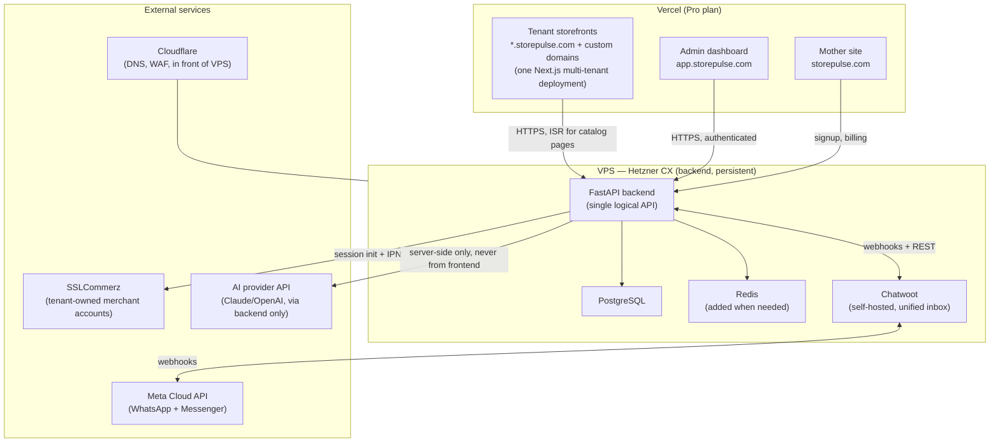
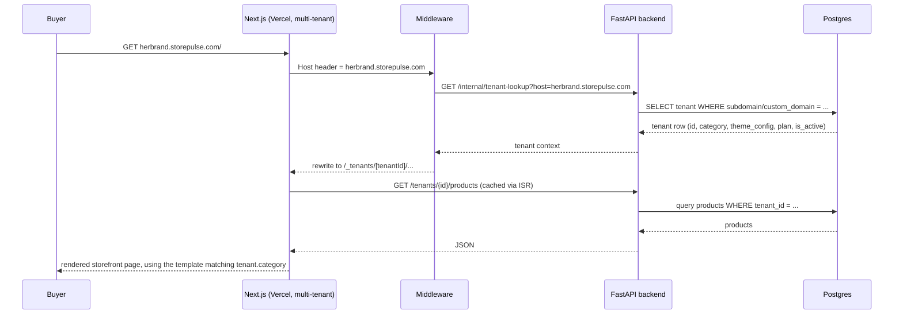
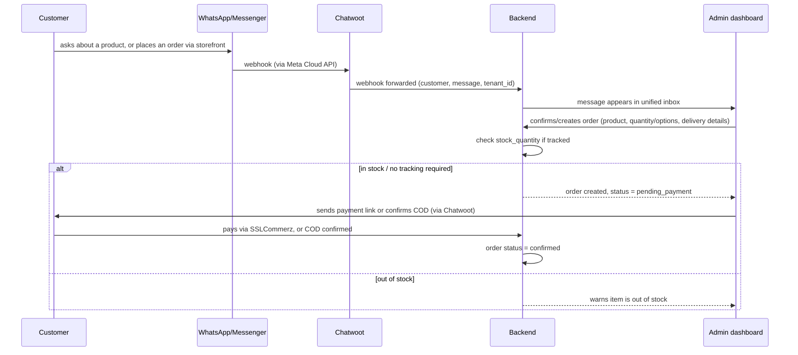

# StorePulse — Technical Knowledge Base & Development Specification

**Purpose of this document:** this is the single source of technical truth for building StorePulse. It is written to be handed to an agentic coding tool (Claude Code) as ongoing context — architecture, data model, and phased build order all live here so implementation work can proceed section by section without re-litigating decisions already made.

**Target market:** small-to-medium Bangladeshi businesses selling online, across categories — fashion, beauty, electronics, home & kitchen, food, and others (matching the 5 landing-page templates already built). This is a horizontal, multi-category platform, not a single-vertical product.

**Status:** Pre-build. No backend/admin code written yet. This spec defines what Phase 3–6 of the project tracker actually means technically.

---

## 1. Product Vision

One shared backend and admin dashboard, many branded customer-facing storefronts. A small business owner — selling clothing, cosmetics, gadgets, kitchenware, or food — signs up, gets a branded storefront (`herbrand.storepulse.com` or her own domain) styled from a category-appropriate template, and an admin dashboard covering: orders, product catalog, a unified WhatsApp/Messenger inbox, customer records, and AI-assisted content and reply drafting. StorePulse is the platform operator, running one backend that serves every tenant regardless of category.

Non-goals for v1: multi-vendor marketplace features, native mobile apps, deep category-specific workflows (e.g. appointment booking, made-to-order production scheduling) unless a specific paying tenant need justifies building one as an optional module later. Building narrow vertical features before there's a tenant asking for them is premature.

---

## 2. System Architecture

### 2.1 High-level architecture



### 2.2 Tenant request routing (storefront)



**Critical rule, restated from earlier security review:** tenant identity is *never* trusted from a client-supplied header or query param on any state-changing or data-scoped request. It is resolved server-side from the verified `Host` header (storefront, public reads) or from a validated JWT claim set at login (admin dashboard, all writes).

### 2.3 Order → inbox → fulfillment flow (general)



---

## 3. Tech Stack

| Layer | Choice | Why |
|---|---|---|
| Tenant storefronts | Next.js 14+ (App Router), Tailwind CSS | Matches existing template work (5 category templates already built); Vercel-native |
| Admin dashboard | Next.js 14+ (App Router), Tailwind CSS, shadcn/ui | Single app, same stack as storefronts, shared component library |
| Mother site | Next.js 14+ | Same stack, marketing + signup + billing |
| Frontend hosting | Vercel (Pro plan — required once commercial, per ToS) | Multi-tenant custom domains built-in, no per-domain fee, ISR for catalog pages |
| Backend API | FastAPI (Python) | Matches founder's existing skillset; async; Pydantic validation |
| Database | PostgreSQL | Relational integrity for tenant-scoped data; row-level tenant_id partitioning |
| Cache/queue | Redis | Deferred until a concrete feature needs it (real-time inbox at scale) |
| Backend hosting | VPS (Hetzner, CX line) | Persistent process needed for WebSockets/long AI calls; far cheaper than serverless-everything |
| Unified inbox | Chatwoot (self-hosted) | Existing FB Messenger + WhatsApp Cloud API channel support; don't rebuild this |
| Payments | SSLCommerz (tenant-owned merchant accounts) | Avoids payment-aggregator licensing; bKash personal-number + COD fallback for unregistered sellers |
| WhatsApp onboarding | Meta Embedded Signup v4 | Self-serve per-tenant WABA connection; v2 deprecates Oct 2026 |
| Object storage | Cloudflare R2 | Zero egress fees vs S3, matters once many tenants serve product images |
| Auth | Auth.js (NextAuth) or managed provider | Do not hand-roll auth |
| AI provider | Claude or OpenAI API, called server-side only | Never exposed to frontend; human-in-the-loop for anything consequential |
| CI/CD | GitHub Actions | Free at this scale; lint + typecheck + auth/payment/tenant-isolation tests on every push |
| Monitoring | Sentry + UptimeRobot (free tiers initially) | Upgrade when revenue justifies it |

---

## 4. Multi-Tenancy Model

- **Isolation strategy:** single shared Postgres database, every tenant-scoped table carries a `tenant_id` foreign key (row-level partitioning — same pattern used by every major multi-tenant SaaS at this scale).
- **Tenant resolution for reads (storefront):** resolved from the verified `Host` header via middleware → backend lookup → cached.
- **Tenant resolution for writes (admin actions):** resolved from the authenticated session's JWT claim, set once at login and never re-derived from client input.
- **Enforcement:** every database query that touches a tenant-scoped table must filter by `tenant_id`. This is enforced via a shared query dependency/helper in the backend (see §6.2), and covered by automated regression tests that assert cross-tenant reads are impossible.
- **Category/template selection:** each tenant has a `category` field (fashion | beauty | electronics | home_kitchen | food | other) used to select which storefront template renders their site. Adding a new category later means adding a new template, not changing the backend schema.

---

## 5. Data Model

### 5.1 Core entities (Postgres)

```sql
CREATE TABLE tenants (
    id UUID PRIMARY KEY DEFAULT gen_random_uuid(),
    business_name VARCHAR(255) NOT NULL,
    category VARCHAR(50) NOT NULL DEFAULT 'other', -- fashion | beauty | electronics | home_kitchen | food | other
    subdomain VARCHAR(63) UNIQUE NOT NULL,
    custom_domain VARCHAR(255) UNIQUE,
    plan_tier VARCHAR(50) NOT NULL DEFAULT 'starter',
    is_active BOOLEAN NOT NULL DEFAULT TRUE,
    theme_config JSONB NOT NULL DEFAULT '{}',
    whatsapp_number VARCHAR(20),
    sslcommerz_store_id VARCHAR(255),
    sslcommerz_store_password_encrypted TEXT,
    created_at TIMESTAMPTZ NOT NULL DEFAULT NOW()
);

CREATE TABLE admin_users (
    id UUID PRIMARY KEY DEFAULT gen_random_uuid(),
    tenant_id UUID NOT NULL REFERENCES tenants(id) ON DELETE CASCADE,
    email VARCHAR(255) UNIQUE NOT NULL,
    hashed_password TEXT, -- null if using OAuth-only via Auth.js
    role VARCHAR(50) NOT NULL DEFAULT 'owner', -- owner | staff
    created_at TIMESTAMPTZ NOT NULL DEFAULT NOW()
);

CREATE TABLE products (
    id UUID PRIMARY KEY DEFAULT gen_random_uuid(),
    tenant_id UUID NOT NULL REFERENCES tenants(id) ON DELETE CASCADE,
    name VARCHAR(255) NOT NULL,
    description TEXT,
    base_price NUMERIC(12,2) NOT NULL,
    stock_quantity INT, -- null = not tracked; set a number to enable stock deduction on order
    images TEXT[],
    is_active BOOLEAN NOT NULL DEFAULT TRUE,
    -- options_schema describes configurable choices (size, color, flavor, spec)
    -- kept generic/JSONB so the same table serves every category/template
    options_schema JSONB NOT NULL DEFAULT '[]',
    created_at TIMESTAMPTZ NOT NULL DEFAULT NOW(),
    CONSTRAINT unique_tenant_product_name UNIQUE (tenant_id, name)
);

CREATE TABLE customers (
    id UUID PRIMARY KEY DEFAULT gen_random_uuid(),
    tenant_id UUID NOT NULL REFERENCES tenants(id) ON DELETE CASCADE,
    name VARCHAR(255),
    phone VARCHAR(20) NOT NULL,
    whatsapp_id VARCHAR(255),
    address TEXT,
    created_at TIMESTAMPTZ NOT NULL DEFAULT NOW(),
    CONSTRAINT unique_tenant_customer_phone UNIQUE (tenant_id, phone)
);

CREATE TABLE orders (
    id UUID PRIMARY KEY DEFAULT gen_random_uuid(),
    tenant_id UUID NOT NULL REFERENCES tenants(id) ON DELETE CASCADE,
    customer_id UUID NOT NULL REFERENCES customers(id),
    product_id UUID NOT NULL REFERENCES products(id),
    quantity INT NOT NULL DEFAULT 1,
    selected_options JSONB NOT NULL DEFAULT '{}', -- e.g. {"size":"L","color":"black"}
    delivery_address TEXT,
    delivery_method VARCHAR(20) NOT NULL DEFAULT 'courier', -- courier | pickup
    total_price NUMERIC(12,2) NOT NULL,
    deposit_amount NUMERIC(12,2) NOT NULL DEFAULT 0, -- optional advance payment, used by categories/sellers that need it
    deposit_paid_at TIMESTAMPTZ,
    balance_paid_at TIMESTAMPTZ,
    status VARCHAR(30) NOT NULL DEFAULT 'draft',
    -- draft -> pending_payment -> confirmed -> shipped -> delivered -> cancelled
    special_instructions TEXT,
    created_at TIMESTAMPTZ NOT NULL DEFAULT NOW()
);
CREATE INDEX idx_orders_tenant_status ON orders(tenant_id, status);

CREATE TABLE messages (
    id UUID PRIMARY KEY DEFAULT gen_random_uuid(),
    tenant_id UUID NOT NULL REFERENCES tenants(id) ON DELETE CASCADE,
    customer_id UUID REFERENCES customers(id),
    channel VARCHAR(20) NOT NULL, -- whatsapp | facebook
    chatwoot_conversation_id VARCHAR(255),
    is_outbound BOOLEAN NOT NULL DEFAULT FALSE,
    body TEXT,
    ai_suggested_reply TEXT, -- populated by AI, never auto-sent
    created_at TIMESTAMPTZ NOT NULL DEFAULT NOW()
);

CREATE TABLE payments (
    id UUID PRIMARY KEY DEFAULT gen_random_uuid(),
    tenant_id UUID NOT NULL REFERENCES tenants(id) ON DELETE CASCADE,
    order_id UUID NOT NULL REFERENCES orders(id),
    provider VARCHAR(20) NOT NULL, -- sslcommerz | manual_bkash | cod
    amount NUMERIC(12,2) NOT NULL,
    provider_transaction_id VARCHAR(255),
    status VARCHAR(20) NOT NULL DEFAULT 'pending',
    verified_at TIMESTAMPTZ,
    created_at TIMESTAMPTZ NOT NULL DEFAULT NOW()
);

CREATE TABLE subscriptions (
    id UUID PRIMARY KEY DEFAULT gen_random_uuid(),
    tenant_id UUID NOT NULL REFERENCES tenants(id) ON DELETE CASCADE,
    plan_tier VARCHAR(50) NOT NULL,
    status VARCHAR(20) NOT NULL DEFAULT 'active', -- active | past_due | cancelled
    current_period_end DATE,
    created_at TIMESTAMPTZ NOT NULL DEFAULT NOW()
);

CREATE TABLE ai_usage_log (
    id UUID PRIMARY KEY DEFAULT gen_random_uuid(),
    tenant_id UUID NOT NULL REFERENCES tenants(id) ON DELETE CASCADE,
    feature VARCHAR(50) NOT NULL, -- reply_suggestion | product_description | insight_summary
    tokens_used INT,
    created_at TIMESTAMPTZ NOT NULL DEFAULT NOW()
);
```

### 5.2 Why `options_schema` and `selected_options` are JSONB, not fixed columns

A fashion tenant needs size/color; an electronics tenant needs spec variants; a food tenant needs flavor/portion size. Keeping product configuration schema-driven (JSONB) rather than fixed columns means one `products`/`orders` table serves every category/template without per-category migrations. The tradeoff (harder to query/index specific option values at scale) is acceptable at this stage.

### 5.3 Category-specific features as optional modules, not core schema changes

If a specific paying tenant needs something category-specific (e.g. a made-to-order business wanting production-date scheduling, or a service business wanting appointment booking), build it as an additive, optional module scoped to tenants who opt in — not as a core schema assumption that every tenant carries. This keeps the core platform genuinely horizontal.

---

## 6. Admin Panel Feature Specification

Compiled from Shopify, WooCommerce, Magento, and BigCommerce feature sets, plus 2026 AI-commerce trend research (unified inbox with AI-drafted replies, natural-language analytics, automated marketing).

### 6.1 MVP (Phase 3–4 of project tracker)

| Module | Features |
|---|---|
| **Dashboard/home** | Today's orders, revenue this month, low-stock alerts (if tracked), unread messages count |
| **Orders** | List/filter by status; create manual/draft order; edit order; status pipeline (draft → pending_payment → confirmed → shipped → delivered → cancelled) |
| **Products** | Create/edit product with configurable options (size, color, spec, flavor — via `options_schema`); image upload; optional stock quantity tracking; active/inactive toggle |
| **Customers** | List, search by phone/name; order history per customer; manually-added notes |
| **Payments** | Record payment (manual, COD, or SSLCommerz-verified); payment status per order |
| **Storefront settings** | Business name, category/template selection, logo, theme color, WhatsApp number, custom domain setup |
| **Staff/roles** | Owner + staff roles (basic — full permission matrix is Phase 2) |

### 6.2 Phase 2 (post-MVP, once paying tenants exist)

| Module | Features |
|---|---|
| **Unified inbox** | Chatwoot-embedded view; FB Messenger + WhatsApp in one thread list; "create order from chat" shortcut |
| **AI reply suggestions** | Drafted reply shown to staff, never auto-sent (human-in-the-loop, per earlier security review) |
| **Discounts** | Coupon codes, percentage/flat discounts, seasonal offers |
| **Shipping** | Basic flat-rate/zone-based shipping rules; courier handoff notes |
| **Reports** | Revenue over time, best-selling products, repeat-customer rate |
| **Marketing** | Basic Facebook/Instagram post scheduling assist; AI-generated product descriptions |
| **Notifications** | SMS/WhatsApp automated order-status updates to customers |

### 6.3 Phase 3 (scale features, not before revenue justifies them)

- AI SEO suggestions, AI brand-identity starter kit (paid add-on, not free-tier — generation cost per use)
- Full permission matrix / audit log
- Abandoned-cart/order-form recovery reminders
- Category-specific optional modules (e.g. appointment booking, made-to-order scheduling) built only when a paying tenant's category needs it

**Explicitly out of scope for all phases unless a real tenant need emerges:** multi-vendor marketplace, native mobile app (PWA covers this), loyalty points programs.

---

## 7. API Specification (outline)

All endpoints prefixed `/api/v1/`. Tenant-scoped endpoints require either a valid admin session (JWT) or resolve tenant from `Host` header (public storefront reads only).

```
POST   /auth/login
POST   /auth/logout
GET    /auth/me

GET    /internal/tenant-lookup?host=              # used by Next.js middleware only, internal network

GET    /tenants/{tenant_id}/products               # public, ISR-cached
POST   /admin/products                             # tenant from JWT
PATCH  /admin/products/{id}
DELETE /admin/products/{id}

GET    /admin/orders?status=
POST   /admin/orders
PATCH  /admin/orders/{id}

GET    /admin/customers
GET    /admin/customers/{id}

POST   /payments/sslcommerz/init
POST   /webhooks/sslcommerz/ipn                    # signature-verified
POST   /payments/manual                            # record COD/bKash manual payment

POST   /webhooks/meta                              # signature-verified, forwarded to/from Chatwoot
GET    /admin/messages?conversation_id=
POST   /admin/messages/{id}/ai-suggest              # returns suggestion, does not send

GET    /admin/dashboard/summary

POST   /billing/subscribe
POST   /webhooks/billing                            # subscription status changes
```

---

## 8. Security Requirements (non-negotiable, restated for the build)

1. **Auth via Auth.js or a managed provider** — never hand-rolled session/JWT logic.
2. **Tenant ID never trusted from client input** — resolved server-side only (§4).
3. **Webhook signature verification required** on `/webhooks/meta` and `/webhooks/sslcommerz/ipn` before processing any payload.
4. **Input validation**: Pydantic models on every FastAPI endpoint; Zod schemas on every Next.js form.
5. **Secrets** (SSLCommerz password, DB credentials, AI API keys) stored in environment variables / secrets manager, never in source, never sent to the frontend.
6. **AI is suggestion-only** for anything consequential (replies, pricing, refunds) until there's a specific, deliberate decision to automate a narrow, low-risk action with monitoring.
7. **CORS** locked to known frontend origins (mother site, admin dashboard, `*.storepulse.com`, and registered custom domains) — not wildcard.
8. **Automated tests required** (CI-blocking) for: tenant isolation on every list/detail endpoint, auth flows, payment webhook signature verification.

---

## 9. Repository Structure

```
/apps
  /storefront        # Next.js — multi-tenant customer-facing storefronts (per-category templates)
  /admin             # Next.js — admin dashboard (single app, all tenants, all categories)
  /mother            # Next.js — marketing site + signup + billing
/services
  /api               # FastAPI backend
    /app
      /routers
      /models
      /schemas       # Pydantic
      /core          # auth, tenant resolution, config
      /tests
/packages
  /ui                # shared Tailwind/shadcn components used by admin + mother (storefront templates keep their own themed components)
/infra
  /docker-compose.yml
  /nginx (if needed in front of FastAPI on the VPS)
```

---

## 10. Development Phases for Claude Code

This maps onto the existing project tracker's Phase 6 (multi-tenant engine) but broken into buildable technical increments. Work top to bottom; each step should be independently testable before moving to the next.

1. **Backend skeleton**: FastAPI app, Postgres connection, `tenants` + `admin_users` tables, Auth.js-compatible login endpoint, tenant-resolution dependency (§4) with tests proving cross-tenant access is blocked.
2. **Products + Orders core**: CRUD for products (with `options_schema`, optional `stock_quantity`), orders (with status pipeline and stock deduction where tracked).
3. **Admin dashboard shell**: Next.js app, auth-gated, dashboard home + orders list + product list, calling the backend from step 1–2.
4. **Storefront (single-tenant first)**: adapt one existing landing-page template into a real ordering flow (product → options → quantity → submit) hitting the backend.
5. **Payments**: SSLCommerz session init + IPN webhook (signature-verified) + manual payment recording.
6. **Multi-tenant storefront routing**: wildcard middleware + tenant lookup (§2.2), migrate from single-tenant to the real multi-tenant pattern, wiring in the category → template selection.
7. **Unified inbox**: self-host Chatwoot, Meta Embedded Signup v4 integration, webhook forwarding into the `messages` table, embed/link in admin dashboard.
8. **AI reply suggestions**: server-side call to AI provider, suggestion shown in inbox UI, never auto-sent; `ai_usage_log` tracking for future plan-gating.
9. **Billing**: subscription table, mother-site signup flow, manual invoicing acceptable initially (full automation is not a blocker for launch).
10. **Hardening**: CI pipeline (lint, typecheck, the security-critical test suite from §8), monitoring (Sentry/UptimeRobot), backup cron for Postgres → R2.

---

## 11. Open Decisions (revisit before or during build)

- Exact subscription tier boundaries and pricing (see business plan §Pricing)
- Whether staff/multi-user access is needed for MVP or can wait (currently deferred to Phase 2)
- SSLCommerz vs. simplified bKash-only flow for the very first pilot tenants (may be faster to launch bKash-manual-only and add SSLCommerz once there's a paying tenant who needs it)
- Which category to onboard the first real pilot tenants in — the 5 existing templates (fashion, beauty, electronics, home & kitchen, food) are all viable starting points
